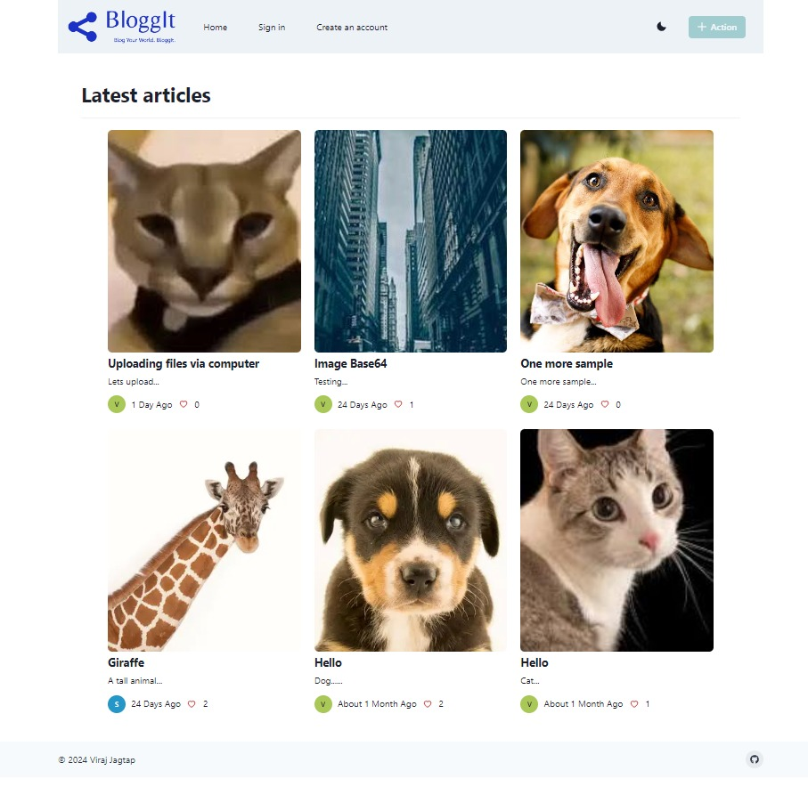
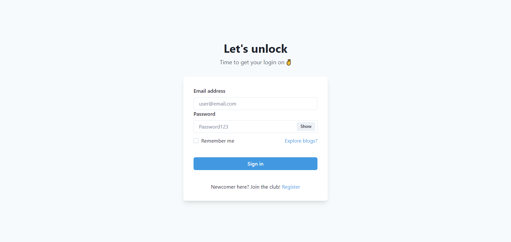
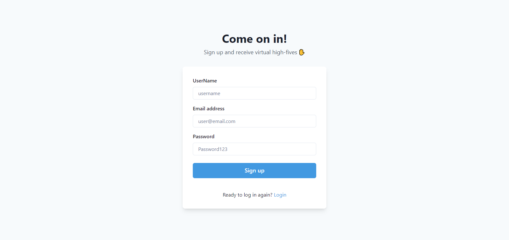
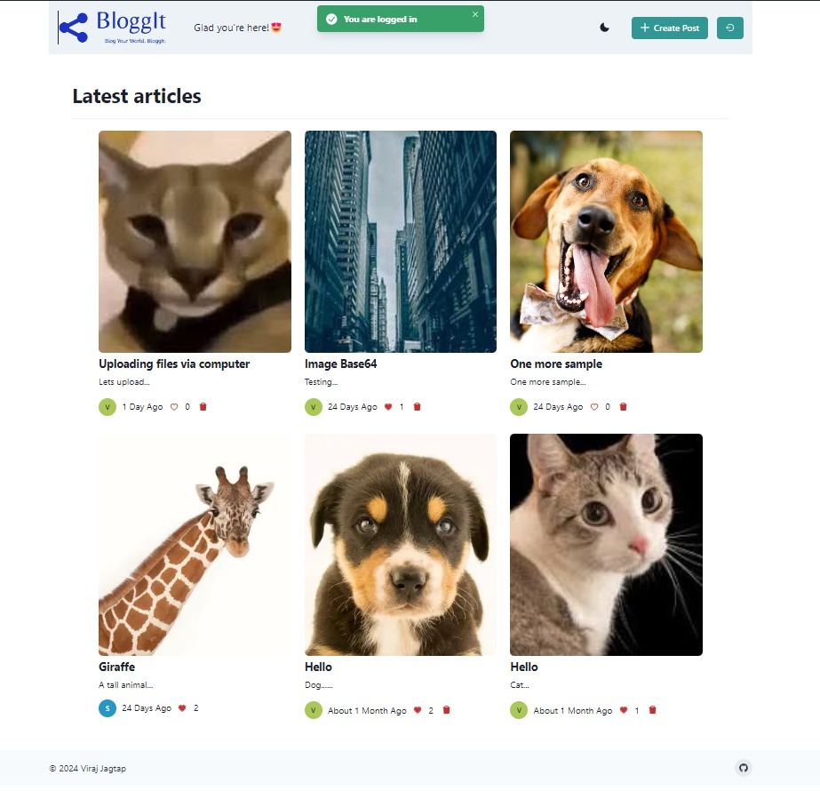
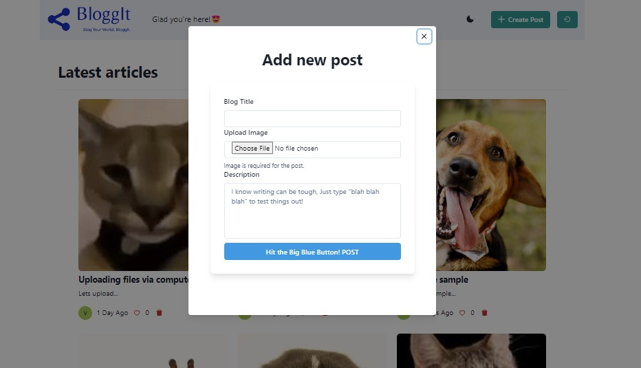

# Blog App with React JS

A blog application with React and Firebase as a backend

## Project Description

This is a React-based blog app that lets users create, like, and delete posts. The app has a responsive design and is built using modern web development techniques. It's a great project to learn how to build a full-stack web application with React and other cutting-edge technologies.

## Services

### Login

You can access some part of posts without logging in, but to access the full post, to create your own posts, you need to login or create an account. If you would like to try out the feature, you can use the following user credentials:

viraj@gmail.com
12345678

### Register

Create a new user by entered email, username, password.

### Home

Upon logging in or registering, users will be directed to the homepage where they can browse all posts created by other users and make their own post, along with their titles and descriptions and image.

### New post

By clicking on the 'Add Post' button, users can access a modal that allows them to create a new post with a title, image and description.

### Others

- Only owner of the post see <b>Delete</b> button
- Logout button
- Guest users view the content

## Setting up the project

To run this project, you need to create a .env file in the root directory of the project and add your Firebase details to it.

1. Create a file named .env in the root directory of the project.
2. Open the .env file and add the following code:

   VITE_FIREBASE_API_KEY=YOUR_FIREBASE_API_KEY

   VITE_FIREBASE_AUTH_DOMAIN=YOUR_FIREBASE_AUTH_DOMAIN

   VITE_FIREBASE_PROJECT_ID=YOUR_PROJECT_ID

   VITE_FIREBASE_STORAGE_BUCKET=YOUR_STORAGEBUCKET

   VITE_FIREBASE_MESSAGING_SENDER_ID=YOUR_MESSAGING_SENDER_ID

   VITE_FIREBASE_APP_ID=YOUR_APP_ID

   VITE_FIREBASE_MEASUREMENT_ID=YOUR_MEASUREMENT_ID

3. Replace the names with your actual Firebase details.
4. Save the .env file.

Once you have created the .env file and added your Firebase details to it, you can run the project.

## Here are some common commands

1. npm install: Installs all the dependencies required for the project.
2. npm run dev: Runs the app in development mode.
3. npm run build: Builds the app for production to the build folder.

## Live

https://blogg-it.netlify.app/